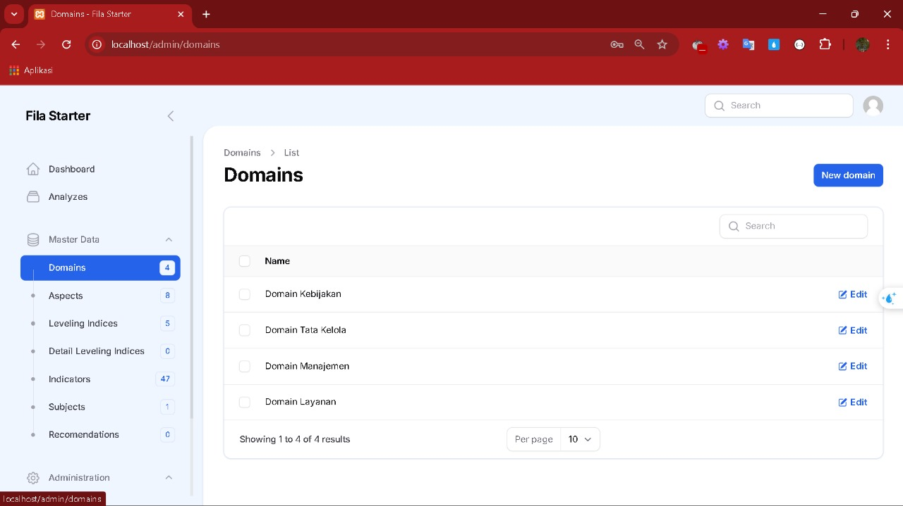
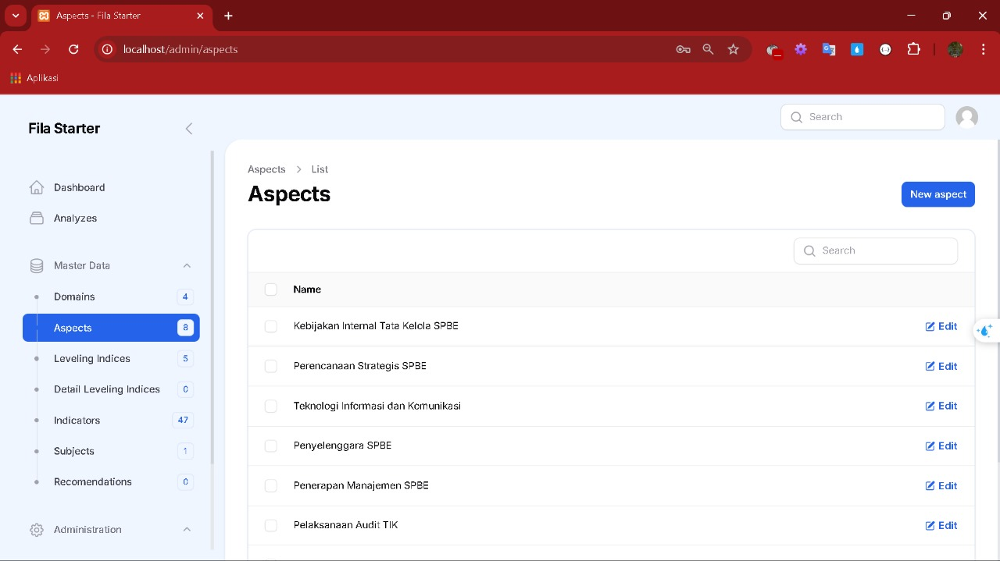
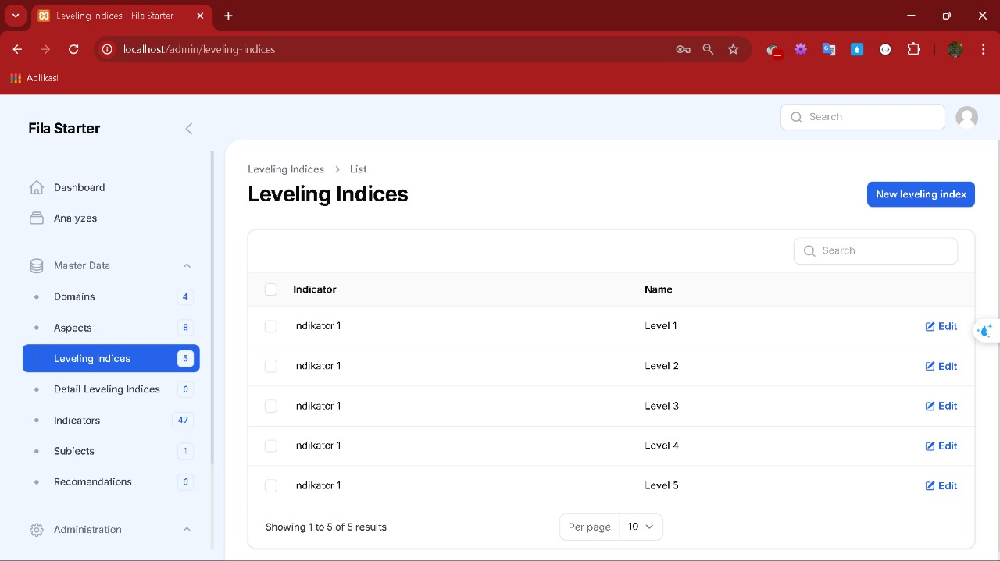
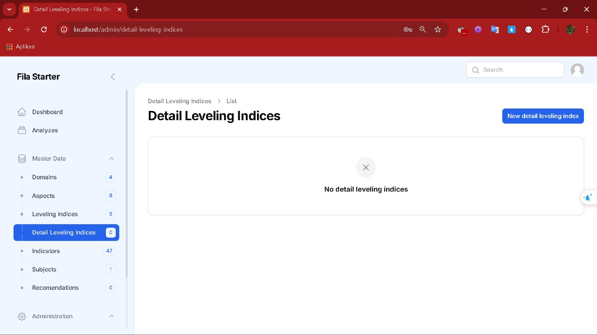
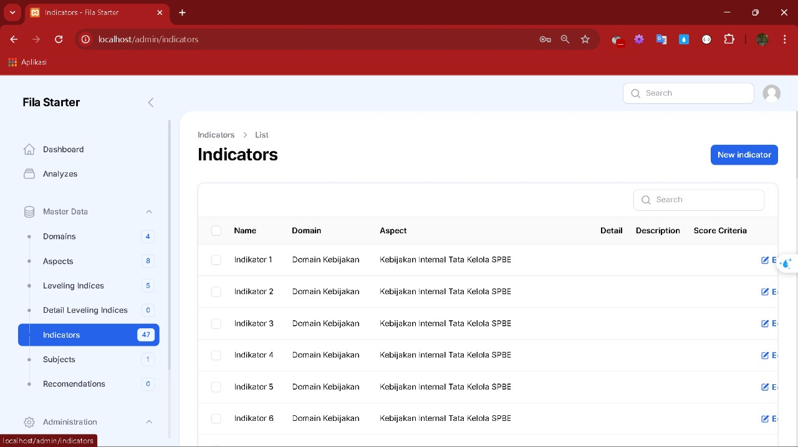
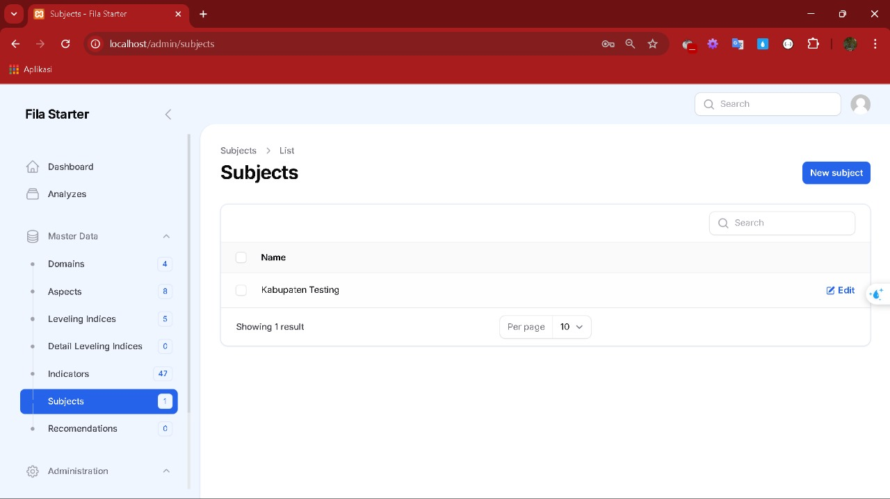
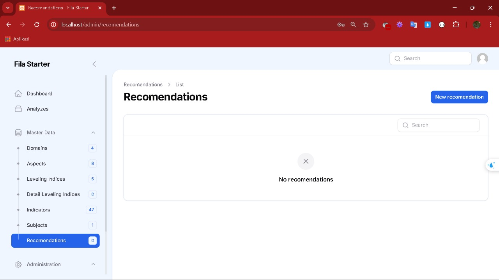
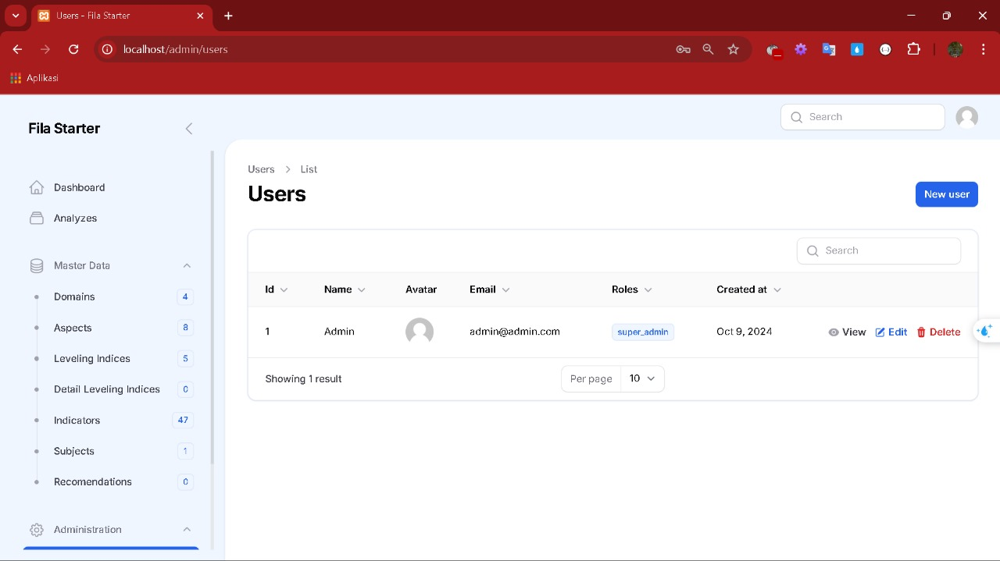
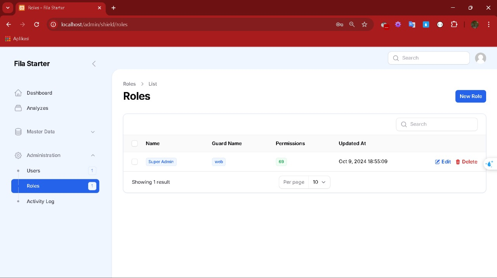
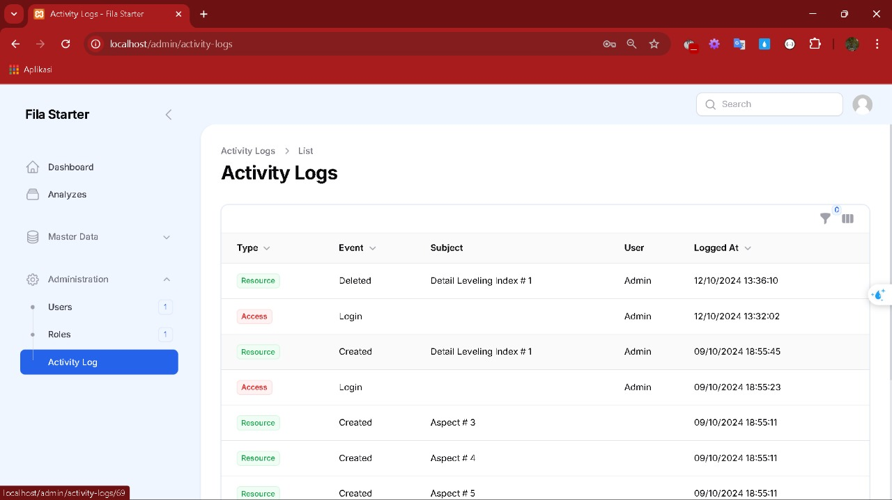

#Keterangan
Pada bagian dokumentasi ini menjelaskan tentang tampilan panel dan fitur yang terdapat pada program yang dibuat. Mulai dari tampilan dashboard menu, halaman, form input dan menu laporan

Struktur Menu pada Panel:
- Dashboard
- Analyzes
- Master Data:
    - Domains
    - Aspects
    - Leveling Indices
    - Detail Leveling Indices
    - Indicators
    - Subjects
    - Recomendations
- Administrations
    - Users
    - Roles
    - Activity Log

## Dashboard

## Master Data

## Administration

