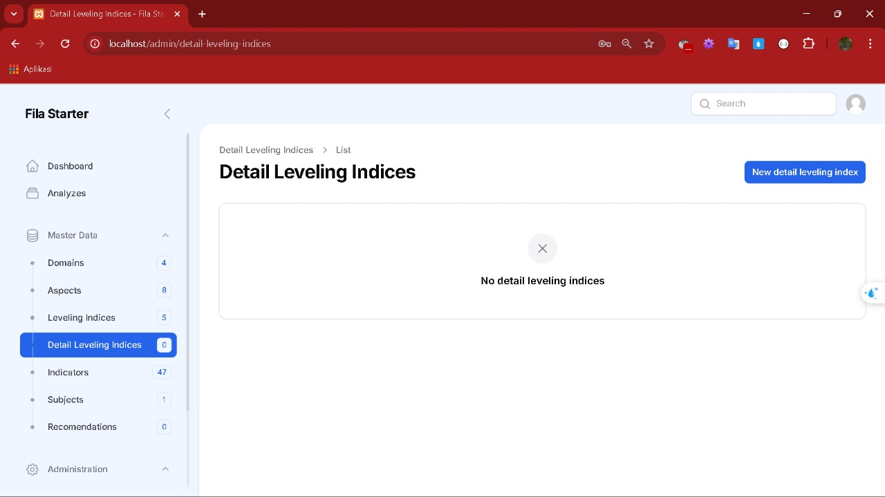

#Keterangan
Pada bagian dokumentasi ini menjelaskan tentang tampilan panel dan fitur yang terdapat pada program yang dibuat. Mulai dari tampilan dashboard menu, halaman, form input dan menu laporan

Struktur Menu pada Panel:
- Dashboard
- Analyzes
- Master Data (Group Menu):
    - Domains
    - Aspects
    - Leveling Indices
    - Detail Leveling Indices
    - Indicators
    - Subjects
    - Recomendations
- Administrations (Group Menu)
    - Users
    - Roles
    - Activity Log

## Dashboard
Area dashboard untuk melihat activity log dan data report

## Master Data (Group Menu)

### Menu Domains

#### Keterangan:

### Menu Aspects

### Menu Leveling Indices

### Menu Detail Leveling Indicies

### Menu Indicators

### Menu Subjects

### Menu Recommendation

## Administration (Group Menu)

### Menu Users

### Menu roles

### Menu Activity Log
